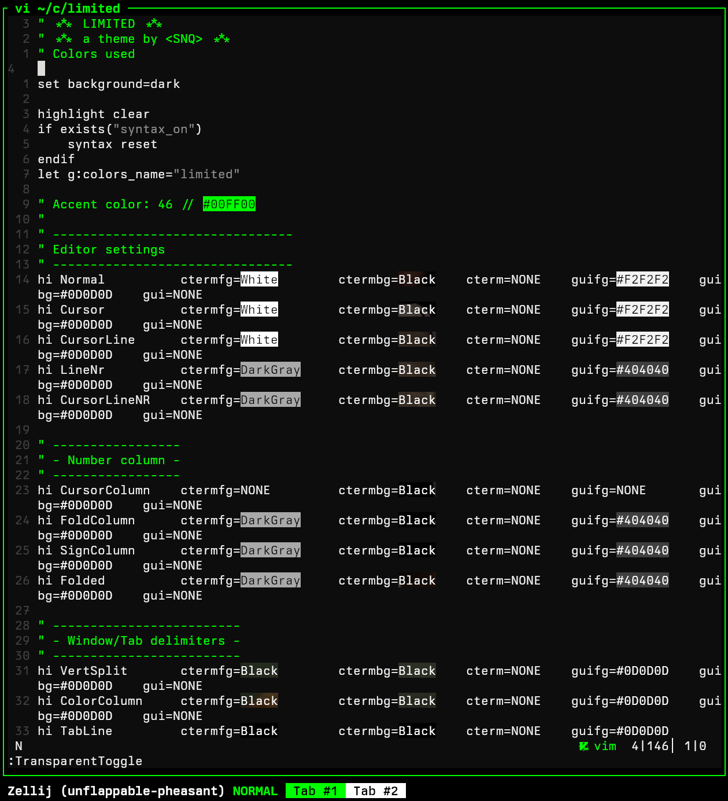

# limited



A minimal monochrome vim/neovim colorscheme with green accents.
Based off of [candle-grey](https://github.com/aditya-azad/candle-grey) with
changes to comments and accent color.

# Installation

-> Using Lazy:

Download via your favourite package manager, for example w/ Lazy:

```

{
  'l-snq/limited',
  lazy = false,
  priority = 1000,
  config = function()
    vim.cmd('colorscheme limited')
  end,
}
```

-> Using Packer:

```
use {
  'l-snq/limited',
  config = function()
    vim.cmd('colorscheme limited')
  end
}
```

# License

MIT
